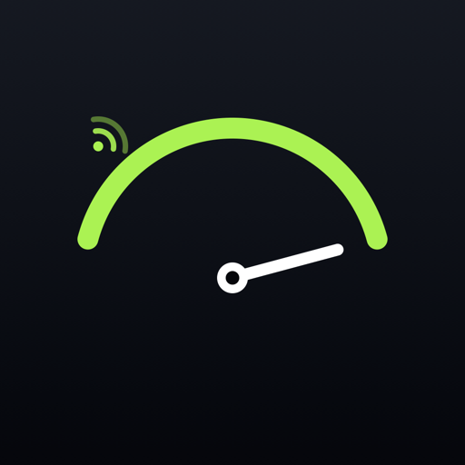
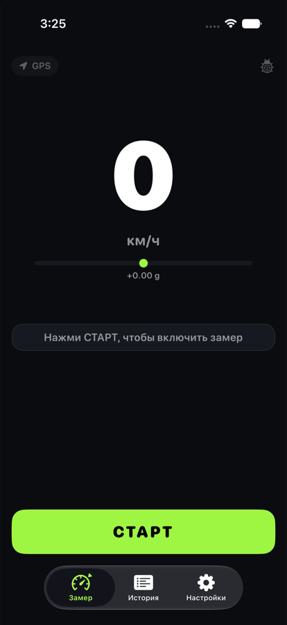
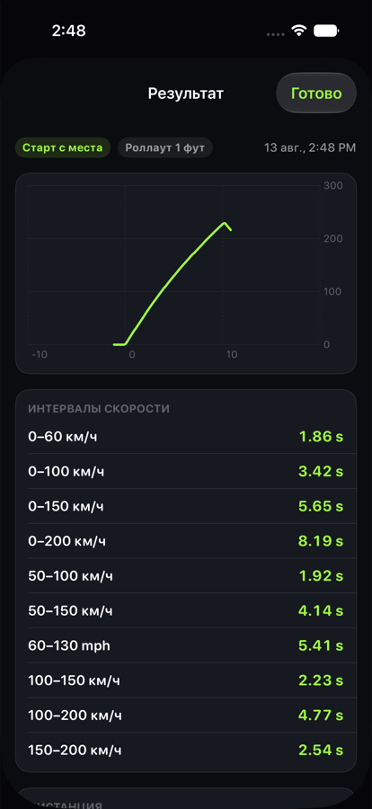
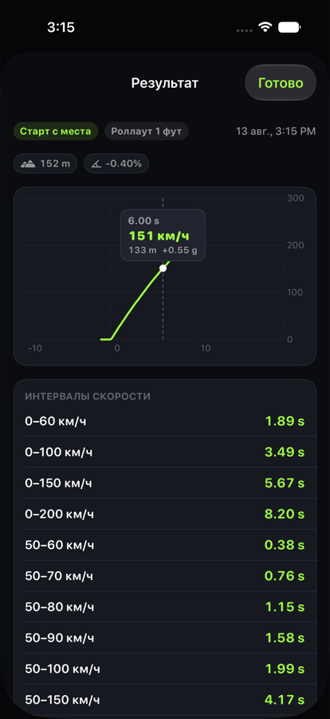
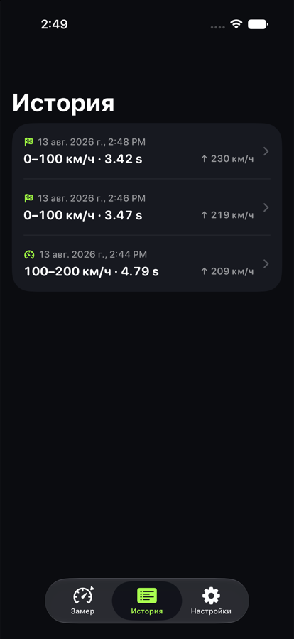

<div align="center">



# Dragly

**GPS-перфометр для авто на iOS — точный замер разгона без внешнего оборудования**

[](https://www.apple.com/ios/)
[](https://www.apple.com/ipados/)
[](https://swift.org)
[](https://developer.apple.com/xcode/swiftui/)
[](https://developer.apple.com/xcode/)

[](https://developer.apple.com/documentation/swiftdata)
[](https://developer.apple.com/documentation/charts)
[](https://developer.apple.com/documentation/corelocation)
[](https://developer.apple.com/documentation/coremotion)
[](https://developer.apple.com/documentation/observation)
[](Dragly/Localizable.xcstrings)

[](https://github.com/ipadev88/Dragly/releases/latest)
[](https://github.com/ipadev88/Dragly/releases)
[](#-стек)

</div>

<div align="center">

&nbsp;
&nbsp;
&nbsp;


</div>

---

## Что это

Аналог Draggy, работающий на одном iPhone. Кладёшь телефон в машину, жмёшь **СТАРТ** — дальше ничего трогать не нужно: приложение само ловит момент разгона и замеряет всё сразу.

**Едешь 90 → топишь в пол** — отсчёт начинается сам при пересечении 100 км/ч, и дальше фиксируются 100–150, 100–200, 150–200, 200–210, 200–250 и так до конца ускорения. Заезд не обрывается на «круглом» числе: пока машина ускоряется, замер продолжается.

## Возможности

| | |
|---|---|
| **Старт с места** | 0–60, 0–100, 0–150, 0–200, 0–250 км/ч (и mph-эквиваленты) |
| **Старт с хода** | Любая пара отметок: 100–200, 150–200, 200–210 … 200–250 |
| **Дистанции** | 60 ft, 100 м, 1/8 мили, 1/4 мили, 1/2 мили, 1 км — с trap speed |
| **Драг-стрип** | Опция 1-foot rollout, trap speed по последним 66 футам |
| **Классика** | 60–130 mph одной строкой |
| **Свои интервалы** | Любой диапазон, например 130–170 — замеряется в каждом заезде |
| **График** | Кривая скорости; зажми — увидишь время, скорость, дистанцию и g в точке |
| **Условия заезда** | Температура, высота, плотностная высота (DA), уклон трассы |
| **История** | Все заезды сохраняются локально, с графиком и полной таблицей |
| **Единицы** | км/ч и mph, метры и футы, °C и °F |

## Как работает точность

GPS в iPhone обновляется примерно раз в секунду — этого мало для сотых долей секунды. Поэтому Dragly не полагается на GPS в одиночку.

```
GPS (1 Гц, допплер) ─┐
                     ├─► фильтр Калмана ─► скорость на 100 Гц ─► интерполяция ─► время
IMU (100 Гц, accel) ─┘        [v, bias]
```

* **Фьюжн-фильтр Калмана.** Состояние — скорость и смещение акселерометра. Предсказание идёт на каждом тике IMU (10 мс), коррекция — на каждом фиксе GPS по допплеровской скорости с её реальной дисперсией.
* **Компенсация задержки GPS.** Фикс приходит с меткой времени в прошлом, поэтому невязка считается против оценки на момент фикса, а не «сейчас». Без этого была систематическая ошибка ≈0.16 с.
* **Ориентация не важна.** Телефон можно положить как угодно: направление движения вычисляется само и защищено от переворота при торможении.
* **Точное время пересечения.** Момент пересечения каждой отметки берётся линейной интерполяцией между тиками фильтра — разрешение 0.01 с.
* **Старт с места** ловится по фронту ускорения (IMU реагирует на порядок раньше GPS), с реплеем окна подтверждения, чтобы не потерять первые 0.2 с.
* **Уклон и DA.** Уклон трассы — с барометра (≈0.1 м по вертикали против метров у GPS), плотностная высота — из давления и температуры.
* **Работает и без IMU.** Если акселерометр недоступен, движок переходит в GPS-only режим — точность падает, но замер идёт.

### Проверенная точность

Движок прогоняется на синтетической физике (шумный GPS с задержкой доставки + смещённый акселерометр) против аналитического эталона:

| Сценарий | Ошибка |
|---|---|
| Старт с места, 0–100 км/ч | ±0.04 с |
| Старт с хода, 100–200 км/ч | ±0.02 с |
| 1/4 мили (ET) | ±0.01 с |
| GPS-only, без акселерометра | ±0.13 с |
| Худший случай по 12 прогонам с разным шумом | ±0.16 с |

> Реальная точность зависит от качества приёма GPS. Телефон должен быть неподвижен относительно машины — в держателе, на сиденье или в кармане; в руках IMU шумит, и точность сползает к GPS-only уровню.

## Установка

### Готовый IPA

Скачай `Dragly.ipa` из [релизов](https://github.com/ipadev88/Dragly/releases/latest). Сборка **без подписи** — подпиши своим Apple ID через [Sideloadly](https://sideloadly.io), [AltStore](https://altstore.io) или Xcode.

### Из исходников

```bash
git clone https://github.com/ipadev88/Dragly.git
cd Dragly
open Dragly.xcodeproj
```

Собери схему **Dragly** на своём устройстве (⌘R). Нужен Xcode 26+ и iOS 26+ на телефоне.

## Стек

Только системные фреймворки Apple — **никаких сторонних зависимостей**, ни SPM, ни CocoaPods.

| Фреймворк | Зачем |
|---|---|
| `SwiftUI` | Весь интерфейс |
| `Observation` | `@Observable`-модели вместо ObservableObject |
| `SwiftData` | История заездов |
| `Charts` | График скорости со скраббером |
| `CoreLocation` | Допплеровская скорость и координаты |
| `CoreMotion` | `CMDeviceMotion` 100 Гц + `CMAltimeter` |
| `Foundation` | Ядро алгоритма — без зависимостей от UI и сенсоров |

## Структура

```
Dragly/
├── Engine/                     ядро, чистый Foundation — тестируется вне устройства
│   ├── KalmanSpeedEstimator    фьюжн GPS + IMU, компенсация задержки фикса
│   ├── RunEngine               конечный автомат заезда, детект отметок
│   └── RunTypes                модели результата, раскладка интервалов
├── Services/                   обёртки сенсоров
│   ├── LocationService         CLLocationManager → SpeedFix
│   ├── MotionService           CMDeviceMotion → AccelTick
│   ├── BarometerService        CMAltimeter → давление и уклон
│   └── SimulatedDriveService   синтетический заезд (только DEBUG)
├── Models/RunRecord            SwiftData-модель заезда
├── App/AppModel                связка сервисы → движок → база
└── Views/                      экраны: замер, результат, история, настройки
```

Ядро (`Engine/`) не импортирует ни CoreLocation, ни CoreMotion, ни SwiftUI — только `Foundation`. Поэтому алгоритм компилируется и проверяется обычным `swiftc` на маке, без симулятора и без машины.

## Разрешения

| Разрешение | Зачем |
|---|---|
| Геопозиция (при использовании) | Допплеровская скорость — основа замера |
| Движение и фитнес | Акселерометр и барометр для точности между фиксами GPS |

Данные никуда не отправляются и остаются на устройстве. Единственный сетевой запрос — температура воздуха по координатам заезда через [Open-Meteo](https://open-meteo.com) (без ключей и аккаунтов); без сети приложение работает полностью, просто не показывает температуру.

## Лицензия

[MIT](LICENSE)
